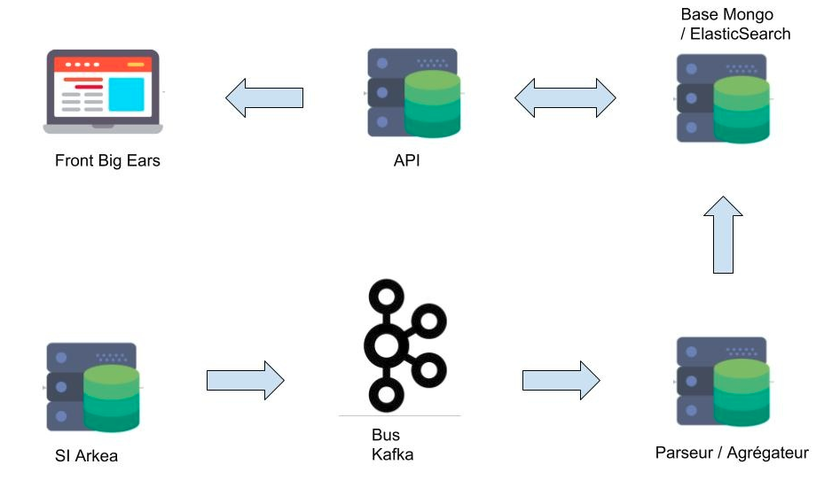

>Big Ears is a project that aims to historize Kafka events of the information system, because currently the policy of retention of these events in the Kafka bus is 8h.
The goal is to be able to render a customer journey based on all the events that this customer will have generated in Arkea's information system.
It allows you to search by topics and by customer number.
In addition, it also standardizes the format of future topics according to naming rules and provides a topic / event associative dictionary to easily know the type of content that can contain a Kafka topic.
In the future, it will also be able to replay certain events in order to debug applications for example.

Technically, bigEars is composed of 3 tools : the Back-end, the front-end and the Rest API.

The back-end it is the tool that, in order, collects the multitude of events from kafka using multi-threaded consumer java, then it enriches the events with additional data before adding them in a database nosql. It use the kafka java API and is written in Java.

The API is the tool that allows us to expose the content of the base mongoDB in a simple and structured way for the front. It use java Spring and annotations.

The front is the heart of bigEars which allows to visualize the historical kafka events. It is written in Vue.js and use Vuex for the state management.

<ul class="actions">
    <li><a href="/" class="button">Back to home</a></li>
</ul>
