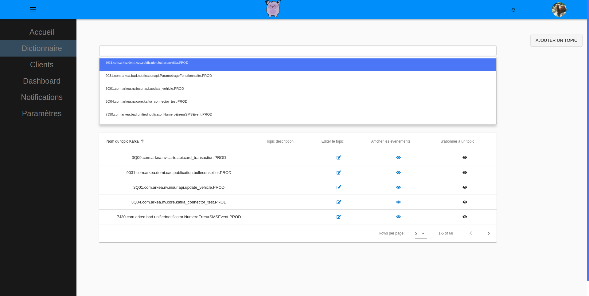

>Big Ears is a project that aims to historize Kafka events of the information system, because currently the policy of retention of these events in the Kafka bus is 8h. The goal is to be able to render a customer journey based on all the events that this customer will have generated in Arkea's information system.
It allows you to search by topics and by customer number.
In addition, it also standardizes the format of future topics according to naming rules and provides a topic / event associative dictionary to easily know the type of content that can contain a Kafka topic.
In the future, it will also be able to replay certain events in order to debug applications for example.

<ul class="actions">
    <li><a href="/" class="button">Back</a></li>
</ul>
